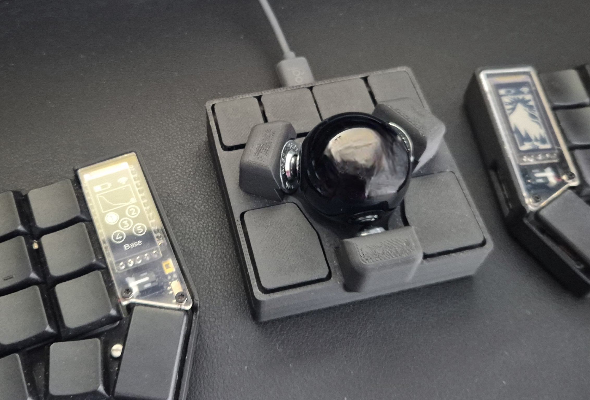
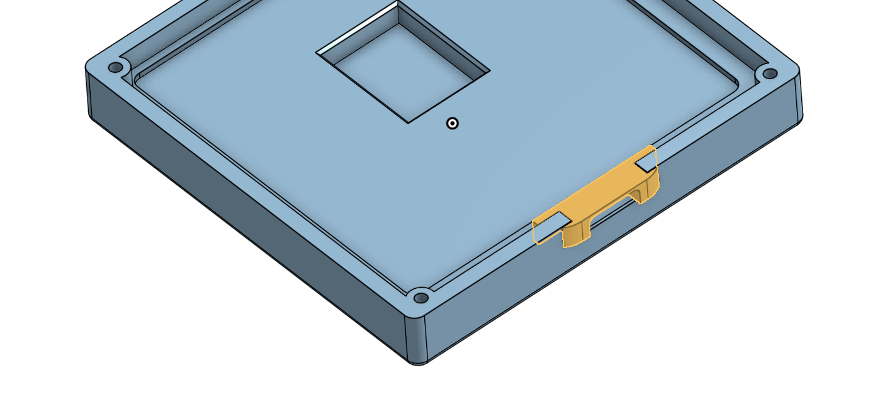

# ploopy-adept-small-btu

A small Ploopy Adept case with BTU bearings

I really like the Ploopy Adept hardware, but I wanted something smaller and lower to use between the two parts of my split keyboard. So I created this case for the Ploopy Adept, which is pretty small and low.

I am sure that this can be done better, but I have been using this for a while and I am quite happy with it. If anyone feels like contributing, here is what I think could get better:

- The top part is a bit hard to print. I had originally designed the top part to snap on the bottom part, but then it would be even more difficult to print, so I went for a flat bottom. The best way I found to print the top part, in order to get a good finish, is to print it in the more regular position, meaning with the buttons up. I added supports and because of the small "springs" in the buttons, you need to be very patient to remove the supports without damaging the buttons.

- I am no expert in compliant mechanisms, but I got inspired by the Ploopy Adept buttons, which are really super well-designed, and tried to do something similar. Because of the size constrains, the spring mechanisms on the front buttons are not super flexible, so in the beginning the 4 front buttons may feel a bit hard to press, but it gets better as you use. There are also small "dead-spots" on the buttons which would be nice to fix, but nothing that have bothered me.

If you do improvements, please do submit a PR :)

## STLs

There are 3 files: top, bottom and usb-insert. The usb-insert is a very small piece that you can insert on the bottom part after you have placed the pcb, as shown below:

## BoM

- [A Ploopy Adept kit](https://ploopy.co/shop/adept-trackball-full-kit/)
- 4 M2 x 4mm thread inserts. I used [these ones](https://www.amazon.de/dp/B088QJG676/ref=pe_27091401_487027711_TE_SCE_dp_i1?th=1)
- 4 M2 x 10mm countersunk screws. I used [these ones](https://www.amazon.de/-/en/gp/product/B0D6QXRH6H/ref=ppx_od_dt_b_asin_title_s00?ie=UTF8&th=1)
- A 34mm trackball. I got mine at [Perixx](https://eu.perixx.com/collections/trackball/products/peripro-303)
- 3 BTU bearings [KU-B8-OFK R053010810](https://store.boschrexroth.com/BALL-TRANSFER-UNIT_R053010810?cclcl=en_MY)

## Assembly

1. Print all the parts and remove evt. supports very carefully from the top part, and avoid damaging the spring mechanisms of the buttons. I would recommend studying the top part a bit, so you get to know where you need to be careful.
2. Insert the 4 thread inserts in the 4 holes on the corners of the bottom of the top part, using a heat-insertion tool or a soldering iron. I would recommend a proper heat-insertion tool like [this one](https://www.amazon.de/dp/B0C5CC2QB9/ref=pe_27091401_487027711_TE_SCE_dp_i1), since these thread inserts are quite small
3. Insert the 3 BTU bearings on the top of the top part. There is some clearance, so you should not need to push very hard, only a bit of force is necessary. If the bearing do not insert easily, make sure to remove evt. material rests from supports and don't apply unnecessary force, which may end up damaging the top part.
4. Place the PCB in the sunken area of the bottom part
5. Place the USB-insert in the USB opening. It should just slide in.
6. Place the top part over the bottom part making sure that the optics are aligned correctly
7. Screw the bottom to the top. Start by screwing all the screws half in and them tighten them up.

And that's all. I hope that you'll enjoy it :).
