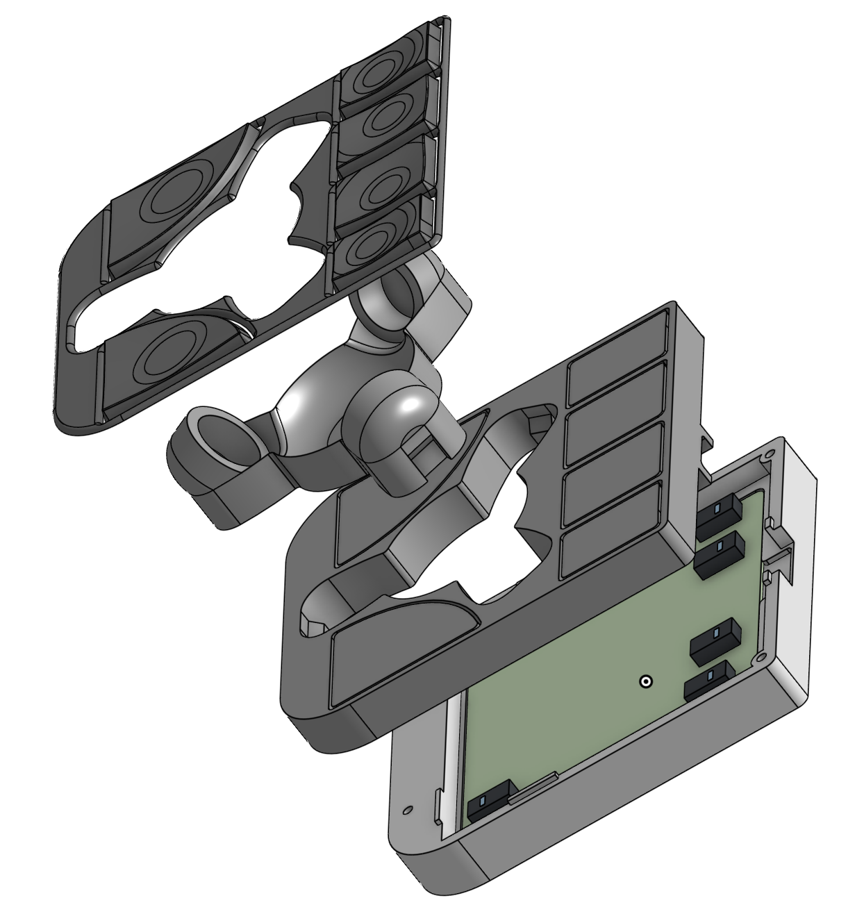

# ploopy-adept-small-btu

A small Ploopy Adept case with BTU bearings

I really like the Ploopy Adept hardware, but I wanted something smaller and lower to use between the two parts of my split keyboard. So I created this case for the Ploopy Adept, which is pretty small and low.

There are 2 versions, one for a 34mm trackball and another for a 38.1mm trackball (1.5 inch). The initial version that I did was for was for a 34mm, but I found that the trackball was a bit too small, so I redesigned it to fit a 38.1mm trackball and also improved the design a lot. So I would recommend going with the 38.1mm design.

Enjoy it! Feedback and contributions are very welcome :).

You can also [buy me a coffee](https://www.paypal.com/donate/?business=VJKKWDQV7A8DU&no_recurring=0&item_name=Buy+me+a+coffee%21&currency_code=USD) if you enjoy it that much :)

# 38.1mm trackball (1.5 inch)

This design consists of 4 parts, see the mechanicals section for the explanation. It prints without supports and require minimal assembly.
Even though the top part consists of 2 separate parts, it looks like a unibody part after assembly.

## Mechanicals

1. 38mm-top-buttons.step: the top frame with buttons and a cut-out for the track ball support insert (part #2)
2. 38mm-top-trackball.step: the trackball insert where the bearings and the trackball should be placed. It fits in the cut-out of the part #1
3. 38mm-bottom.step: the bottom part of the case, where the pcb should be placed
4. (OPTIONAL) 38mm-cover-keycaps.step: a cover to the top, so you can add another finish to the top of the trackball and keycaps. These can be printed in different colors for some extra personalization and/or with a smaller layer height for a smoother surface :)

## Printing instructions/remarks

Part #1 should be printed in PETG because of the small spring mechanisms. The rest can be printed in PLA. I have printed everything with a 0.12mm profile

Part #1 should be printed with the buttons facing the build plate (so upside-down), and the remaining parts should be printed in the regular orientation.

No supports should be needed.

## BoM

- [A Ploopy Adept kit](https://ploopy.co/shop/adept-trackball-full-kit/)
- 4 M2 x 4mm thread inserts. I used [these ones](https://www.amazon.de/dp/B088QJG676/ref=pe_27091401_487027711_TE_SCE_dp_i1?th=1)
- 4 M2 x 10mm countersunk screws. I used [these ones](https://www.amazon.de/-/en/gp/product/B0D6QXRH6H/ref=ppx_od_dt_b_asin_title_s00?ie=UTF8&th=1)
- A 38.1mm trackball (1.5 inch). I have used my Ploopy Nano trackball. You can either buy a billiard ball or something more fit for purpose like this ones from [gamingtrackball](https://www.gamingtrackball.com/products/yellow-and-silver-add-on-balls)
- 3 BTU bearings [KU-B8-OFK R053010810](https://store.boschrexroth.com/BALL-TRANSFER-UNIT_R053010810?cclcl=en_MY)
- (OPTIONAL) Superglue to put some of the parts together

## Assembly

See Mechanicals section above for the part numbers.

1. Print all the parts
2. (OPTIONAL) Glue part #5 to part #1
3. Insert the 3 BTU bearings on part #2. There is some clearance, so you should not need to push very hard, only a bit of force is necessary.
4. Insert part #2 into the cut-out of part #1, making sure that the flat part of the optics cut-out is the round edge of the case (see picture below). Make sure that the bottom aligns perfectly. The part should stay in place, but you may choose to glue them together, if you prefer.

5. Insert the 4 thread inserts in the 4 holes on the corners of the bottom of part #1, using a heat-insertion tool or a soldering iron. I would recommend a proper heat-insertion tool like [this one](https://www.amazon.de/dp/B0C5CC2QB9/ref=pe_27091401_487027711_TE_SCE_dp_i1), since these thread inserts are quite small
6. Place the PCB in the sunken area of part #3
7. Place the top part over the bottom part making sure that the optics are aligned correctly. The bottom part has some small guides that should help placing the top correctly and holding it in place.
8. Screw the bottom to the top. Start by screwing all the screws half in and then tighten them up.

# 34mm trackball

This is what I think is not great with this design. It could be improved using the same ideas that I used on the 38.1mm trackball, but I am not planning to do it anytime soon:

- The top part is a bit hard to print. I had originally designed the top part to snap on the bottom part, but then it would be even more difficult to print, so I went for a flat bottom. The best way I found to print the top part, in order to get a good finish, is to print it in the more regular position, meaning with the buttons up. I added supports and because of the small "springs" in the buttons, you need to be very patient to remove the supports without damaging the buttons.

- The spring mechanisms on the front buttons are not super flexible, so in the beginning the 4 front buttons may feel a bit hard to press, but it gets better as you use. There are also small "dead-spots" on the buttons which would be nice to fix, but nothing that have bothered me.

If you do improvements, please do submit a PR :)

## Mechanicals

There are 3 files: top, bottom and usb-insert. The usb-insert is a very small piece that you can insert on the bottom part after you have placed the pcb, as shown below:

## BoM

- [A Ploopy Adept kit](https://ploopy.co/shop/adept-trackball-full-kit/)
- 4 M2 x 4mm thread inserts. I used [these ones](https://www.amazon.de/dp/B088QJG676/ref=pe_27091401_487027711_TE_SCE_dp_i1?th=1)
- 4 M2 x 10mm countersunk screws. I used [these ones](https://www.amazon.de/-/en/gp/product/B0D6QXRH6H/ref=ppx_od_dt_b_asin_title_s00?ie=UTF8&th=1)
- A 34mm trackball. I got mine at [Perixx](https://eu.perixx.com/collections/trackball/products/peripro-303)
- 3 BTU bearings [KU-B8-OFK R053010810](https://store.boschrexroth.com/BALL-TRANSFER-UNIT_R053010810?cclcl=en_MY)

## Assembly

1. Print all the parts and remove evt. supports very carefully from the top part, and avoid damaging the spring mechanisms of the buttons. I would recommend studying the top part a bit, so you get to know where you need to be careful.
2. Insert the 4 thread inserts in the 4 holes on the corners of the bottom of the top part, using a heat-insertion tool or a soldering iron. I would recommend a proper heat-insertion tool like [this one](https://www.amazon.de/dp/B0C5CC2QB9/ref=pe_27091401_487027711_TE_SCE_dp_i1), since these thread inserts are quite small
3. Insert the 3 BTU bearings on the top of the top part. There is some clearance, so you should not need to push very hard, only a bit of force is necessary. If the bearing do not insert easily, make sure to remove evt. material rests from supports and don't apply unnecessary force, which may end up damaging the top part.
4. Place the PCB in the sunken area of the bottom part
5. Place the USB-insert in the USB opening. It should just slide in.
6. Place the top part over the bottom part making sure that the optics are aligned correctly
7. Screw the bottom to the top. Start by screwing all the screws half in and then tighten them up.
