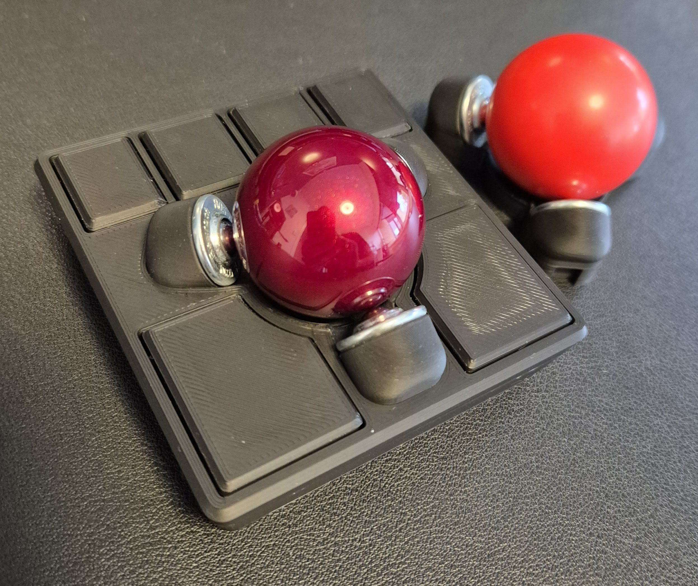
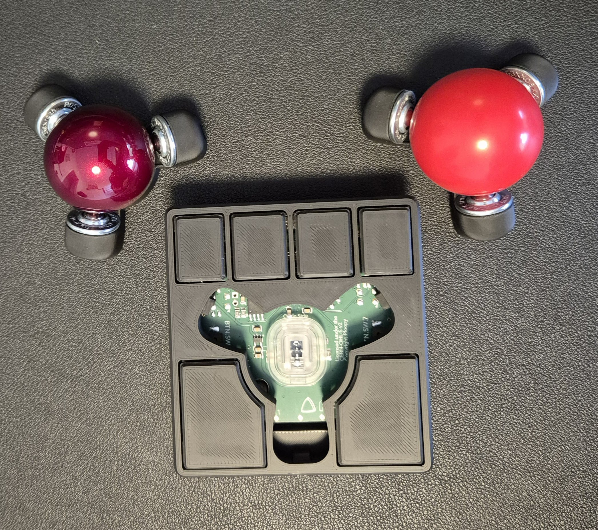
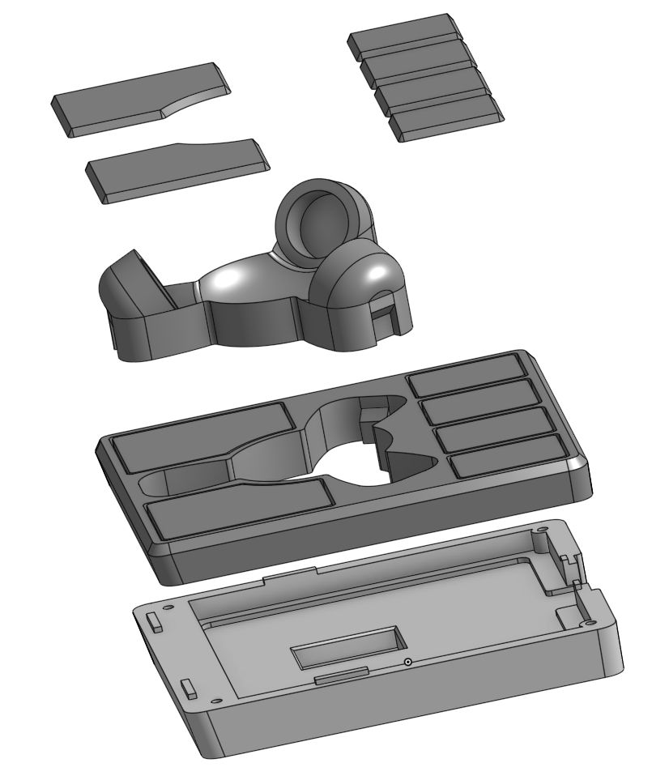
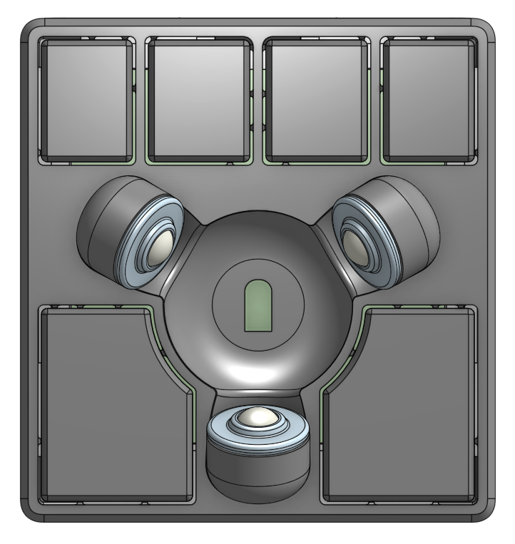

# V3 - 34mm and 38.1mm (1.5 inch) trackball

This design consists of 4 parts, see the mechanicals section for the explanation. It prints without supports and require minimal assembly.
Even though the top part consists of 2 separate parts, it looks like a unibody part after assembly.

## Mechanicals

1. v3-top-no-inserts.step **OR** v3-top.step: the top frame with buttons and a cut-out for the track ball support insert (part #2). If you choose the _no-inserts_ model, you won't need to use thread inserts, you can just screw the M2 screw directly into the case. However, if you do have the thread inserts at hand, I would recommend using them, since the print will last longer in case you disassemble it often.
2. v3-38mm-trackball-support.step **OR** v3-34mm-trackball-support.step: the trackball insert where the bearings and the trackball should be placed. It fits in the cut-out of the part #1. Choose the part the fits the trackball size that you want to use.
3. v3-bottom.step: the bottom part of the case, where the pcb should be placed. The bottom has 4 sunken holes to optionally insert self-adhesive silicone bumpers of 8mm diameter and 1.6mm height.
4. (OPTIONAL) v3-buttons.step: 1.5mm flat raised buttons. They should be glued to the case. I use them and I prefer both the looks and the ergonomics with them on.

## Printing instructions/remarks

**The models print without the need of any support. Using supports will likely ruin the print, unless you really know what you are doing!**

I have printed it in both PLA and PETG and both work fine. I have been using a 0.1mm layer height with good results.

- Part #1 should be printed with the buttons facing the build plate (so upside-down). and the remaining parts should be
- Part #2 and #3 should be printed in the regular orientation, which means with the flat part facing the build plate
- Part #4 can be printed in any orientation. I usually print with the top of the buttons facing the build plate, since I mostly use a smooth plate.

## BoM

- [A Ploopy Adept kit](https://ploopy.co/shop/adept-trackball-full-kit/)
- 4 M2 x 10mm countersunk screws. I used [these ones](https://www.amazon.de/-/en/gp/product/B0D6QXRH6H/ref=ppx_od_dt_b_asin_title_s00?ie=UTF8&th=1)
- A trackball or the appropriate size:
  - 38mm (1.5 inch): I have used my Ploopy Nano trackball. You can either buy a billiard ball or something more fit for purpose like this ones from [gamingtrackball](https://www.gamingtrackball.com/products/yellow-and-silver-add-on-balls)
  - 34mm: I have used a Perixx 34mm trackball. You can find some different models [here](https://eu.perixx.com/collections/trackball)
- 3 BTU bearings [KU-B8-OFK R053010810](https://store.boschrexroth.com/BALL-TRANSFER-UNIT_R053010810?cclcl=en_MY)
- (OPTIONAL) 4 M2 x 4mm thread inserts, if you choose to use the top with thread insert. I used [these ones](https://www.amazon.de/dp/B088QJG676/ref=pe_27091401_487027711_TE_SCE_dp_i1?th=1)
- (OPTIONAL) Self-adhesive silicone bumpers of 8mm diameter and 1.6mm height. Like [these ones](https://www.amazon.com/VOVOV-Small-Cabinet-Furniture-Bumpers/dp/B016GXAZOA/ref=sr_1_6?crid=1V39DSWM85IU4&dib=eyJ2IjoiMSJ9.SgcP7sYZZgOXrCBkl7iuuPCFL0Nj-56Iya6P0XGrPvs3bzrYjZOTrDLDlMdEUKPYCWWu6ZbPwwiI7Q0Ummm3yjJVeaV6FVH-EvrZ4qvgJ0p-566NEA00zdKTkTmAMPUyYR0LQX7c6y4EXeTg_hHIcbnVtDGqnrUUIZGwXum2UeUEcrBks-hpp17420ZKxgjQQB0X6qXWvs8blPHY5gU8Qdu3DRRDklEdPEjvE-BFHh-ygZoauxq05weSDy2hf7AqHQwXhyJjbufgfr9TYE-0jDX_94YVAxTgbFrSxRdIPbs.ZEYgulqsZGt7delUQAZMV-A_qnFjEU9MHROv3y52rKw&dib_tag=se&keywords=silicone+bumpers+8mm&qid=1744587215&sprefix=silicone+bumper+8mm%2Caps%2C161&sr=8-6)
- (OPTIONAL) Superglue to put some of the parts together

## Assembly

See Mechanicals section above for the part numbers.

1. Print all the parts
2. (OPTIONAL) Glue part #4 to part #1
3. Insert the 3 BTU bearings on part #2. There is some clearance, so you should not need to push very hard, only a bit of force is necessary.
4. Insert part #2 into the cut-out of part #1, making sure that the flat part of the optics cut-out is the round edge of the case (see picture below). Make sure that the bottom aligns perfectly. The part should stay in place, but you may choose to glue them together, if you prefer.

5. (OPTIONAL) Insert the 4 thread inserts in the 4 holes on the corners of the bottom of part #1, using a heat-insertion tool or a soldering iron. I would recommend a proper heat-insertion tool like [this one](https://www.amazon.de/dp/B0C5CC2QB9/ref=pe_27091401_487027711_TE_SCE_dp_i1), since these thread inserts are quite small
6. Place the PCB in the sunken area of part #3
7. Place the top part over the bottom part making sure that the optics are aligned correctly. The bottom part has some small guides that should help placing the top correctly and holding it in place.
8. Screw the bottom to the top. Start by screwing all the screws half in and then tighten them up.
